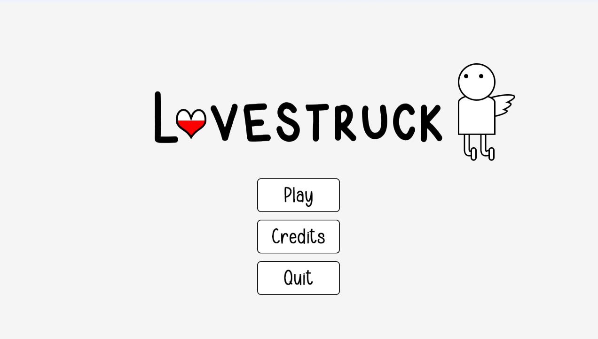
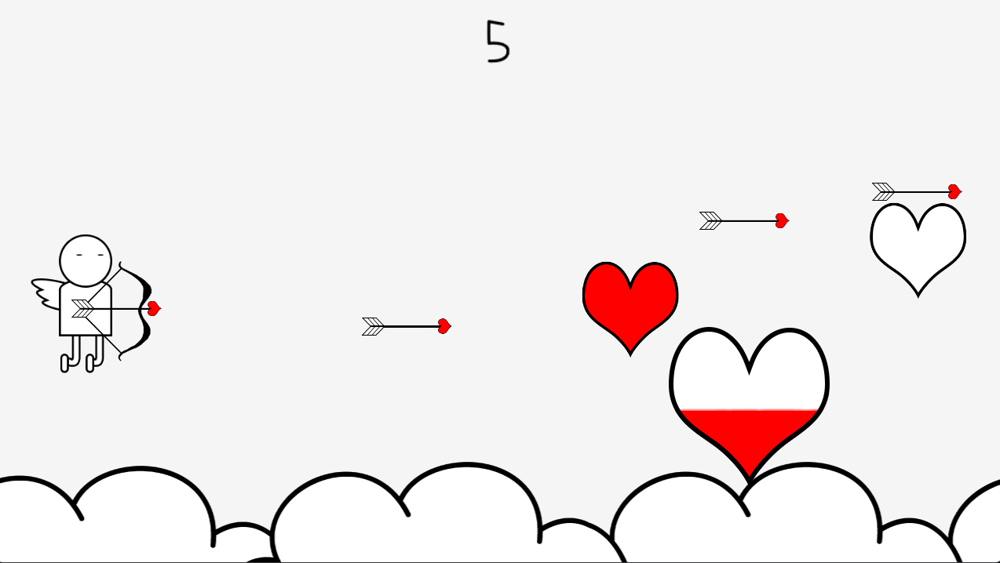
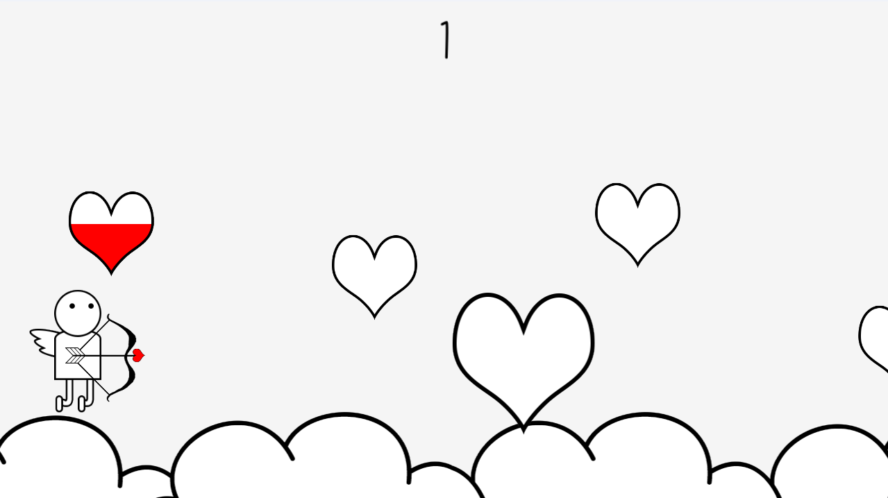

## Lovestruck

### Description

Valentine's Day is Cupid's day to shine. Help Cupid make as many people fall in love
before he is struck by love himself.

Made with the raylib graphics library.

A game by ***FictionalGiggle***.

### Controls

Keyboard:
 - Up Arrow/W to move up
 - Down Arrow/S to move down
 - Spacebar to fire arrow

### Screenshots

### Developers

 - FictionalGiggle - Designer, Programmer, Textures

### Links

 - itch.io Release: [Download Here](https://fictionalgiggle.itch.io/lovestruck)

### License

This game sources are licensed under an unmodified zlib/libpng license, which is an OSI-certified, BSD-like license that allows static linking with closed source software. Check [LICENSE](LICENSE) for further details.

*Copyright (c) 2023 FictionalGiggle ([@wchung42](https://www.github.com/wchung42))*
